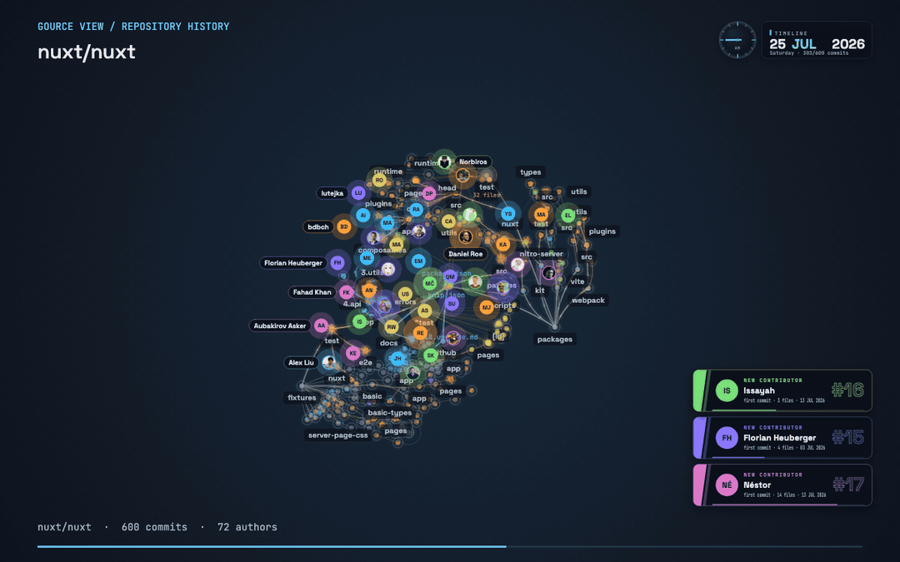
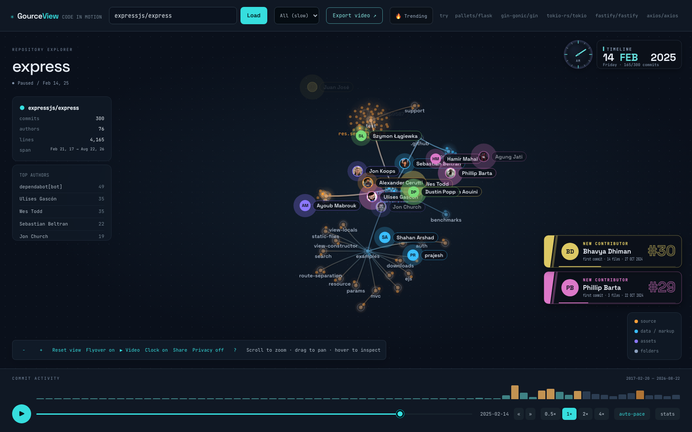
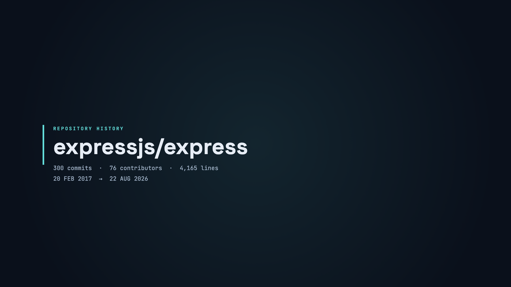
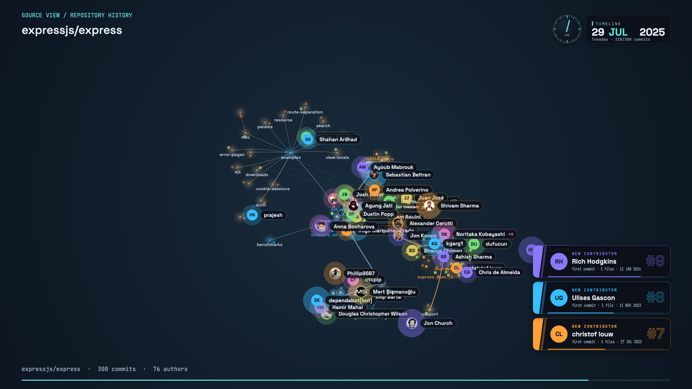
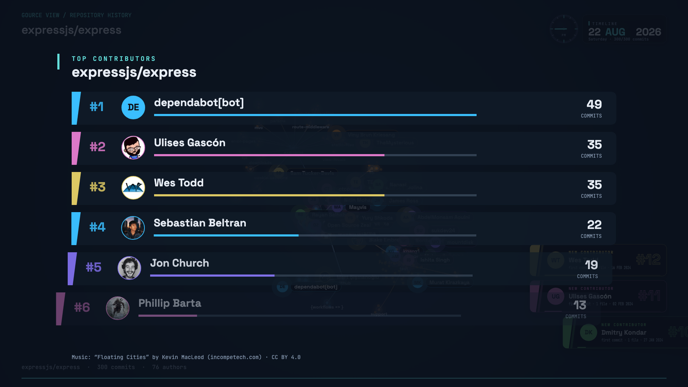

# Gource View

Animated, [Gource](https://github.com/acaudwell/gource)-style visualisation of
a repository's history, in the browser: folders branch out from the root, files
orbit their folders, contributors fly in and beam at what they touch, and a slow
flyover camera drifts over it all. Exports broadcast-ready MP4s with a title
card, a contributor leaderboard and music.

**Live demo:** the GitHub Pages build (see the repository's *Environments*)
plays a handful of pre-built repositories, including fullscreen video mode with
music. Loading *any* repository, branch selection, trending and MP4 export need
the self-hosted server below.



| | |
|---|---|
|  |  |
|  |  |

**Example video:** [expressjs/express, 1080p, 37 s, with music](https://github.com/schlunsen/gource-view/releases/latest) (release asset).

## Self-host

```bash
docker build -t gource-view .
docker run -p 8080:8080 gource-view      # http://localhost:8080
```

The image bundles git, Chromium and FFmpeg. Optional environment: `GITHUB_TOKEN` /
`GITLAB_TOKEN` for private repositories, `GITEA_URL` + `GITEA_TOKEN` for a Gitea
instance (see below), `DEFAULT_REPO`, and the limits listed under *Running it
publicly*.

## Run locally

```bash
npm install
npm run dev          # Vite dev server on http://127.0.0.1:5173 (proxies /api to the backend)
node server/index.js # backend on :8080 (clones, parses history, renders exports)
```

Requires `git`, and for video export `ffmpeg` plus a Chromium (Playwright's or
`CHROMIUM_EXECUTABLE_PATH`).

## Sources

Type any of these in the repository box:

- `owner/name` — GitHub shorthand
- a GitHub URL (extra path such as `/tree/main` is ignored)
- any public https git URL: GitLab (nested groups work), Bitbucket, Codeberg, self-hosted…
- `gitea:owner/name` or a URL of the configured Gitea instance (see below)

Private repositories: set `GITHUB_TOKEN` and/or `GITLAB_TOKEN` (`GITLAB_HOST`
defaults to `gitlab.com`). Tokens are attached as URL-scoped git headers only
for their own host and never appear in commands, remotes or logs. Hosts that
could reach cluster-internal services (loopback, IP literals, `.svc`, `.local`,
…) are refused.

Pick a **branch** from the selector that appears after a load, and choose how
much history to read (300 … 3 000 commits, or *All*). Clones are cached and
refreshed at most every 10 minutes; parsed histories are cached per branch tip.

## Visualization

Files form evenly spaced organic clusters around their folders. Curved branches
carry gentle activity highlights from parent to child; recently changed files
shine brighter while older files remain visible. The camera uses a slow, shallow
orbit. Folder labels choose free space, and contributors spread out around busy
folders with name pills placed only where they fit. Privacy modes also apply to
these labels. The viewer, fullscreen playback and MP4 exports share this renderer.

## Playback

- **Stats** includes a short project description from GitHub or the configured
  Gitea instance when available. Descriptions are hidden in privacy mode.

- **Explore repositories** opens a searchable collection of example projects, on
  desktop and mobile. Search by name, language or description.
- Fresh visits load **300 commits**. Branch selections stay with their repository.
  GitHub Pages uses prebuilt histories and only offers available options.
- Loading a new repository keeps your current visualization until the new one is
  ready. **Stop waiting** returns to it; failed loads offer **Try again** and
  **Back to viewer**. Connection retries are bounded instead of spinning forever.

- **Flyover**: slow orbit, tilt and perspective; the camera leans toward where
  commits land and dollies in on big trees. Toggle with the *Flyover* button or `f`.
- **Auto-pace** (`a`): 1× within a few seconds of a commit, 4× through quiet
  stretches. Exports follow the same warp.
- **Bursts**: orange bins on the activity chart; `n` / `p` or « » jump between them.
- **Share**: copies a link (`?repo=&ref=&t=&speed=…`) that opens paused at that moment.
- **Privacy** (`h`, or the button in the view tools) for closed-source demos:
  *Names hidden* removes every file and folder name (labels, tooltips, the
  repository name); *Names + people hidden* also shows contributors as
  “Contributor N” without photos. Structure, colours and activity still show.
  The level is carried in share links and pre-selected in the export dialog,
  where the repository path is replaced by your title (or “Private repository”).
- **Video mode** (`v`, or ▶ Video): plays the export composition fullscreen —
  title card, paced history, leaderboard — with a music bed and subtle effects.
  Scrub the timeline or use ←/→ to seek five seconds. Space pauses, `r` replays,
  `m` changes music, Esc exits. Music fades in smoothly; volume and effects
  preferences are remembered. Pausing keeps your place in the music. Controls
  stay visible while hovered or focused and fit smaller screens. The scoreboard
  carries an analog clock showing the history's time of day.
- **Trending**: GitHub's trending-this-week list (scraped once a day, cached on
  disk, search-API fallback, clone size flagged when large) — one click loads a repo.
- Press `?` for every keyboard shortcut.

## Export video

*Export video* renders an MP4 on the server: 720p / 1080p / 4K, landscape 16:9
or portrait 9:16, 30 or 60 fps (4K is 30 fps), 15–60 s of history bracketed by a
3 s title card and a 4 s contributor leaderboard. One export runs at a time;
downloads stay available for an hour.

**Music.** Five bundled tracks by Kevin MacLeod (incompetech.com, CC BY 4.0 —
`server/music/`) are looped and faded to the video length; the credit line is
drawn on the closing card and offered for your video description. You can also
upload your own track (MP3/M4A/WAV/OGG, ≤ 25 MB; make sure you hold the rights).
Subtle **sound effects** (a blip per commit, a whoosh per burst, a riser under the
title) sit under the music and can be switched off.

## Static demo (GitHub Pages)

`VITE_STATIC=1 npx vite build --base=/<repo>/ && node scripts/build-static.mjs dist`
bakes six repositories' last 300 commits and the music into `dist/`; the
`Demo (GitHub Pages)` workflow does this on every push to `main` and weekly.

## Checks

```bash
npm test             # unit tests (layout, actors, lifecycle, pacing, cards, sources, soundtrack, export options)
npm run test:video   # renders a real MP4 through FFmpeg and probes it
npm run check        # browser checks (Playwright) against a fresh dev server; `npm run check -- edges` filters
```

The Docker build runs `npm test`, so a failing unit test fails the CI image.

## Running it publicly

The server assumes anonymous internet traffic: per-IP limits (30 loads and 4
exports per hour, `LOAD_LIMIT_PER_HOUR` / `EXPORT_LIMIT_PER_HOUR`), at most 3
concurrent clones, shallow clones sized to the requested history, a 1.5 GB
per-repository cap and a 6 GB clone cache with LRU eviction
(`CLONE_CAP_MB`, `CACHE_CAP_MB`), hosts that resolve to private/link-local
addresses refused, git redirects disabled, request bodies capped, and
nosniff / referrer / CSP headers.

## Gitea sources

Set `GITEA_URL` and `GITEA_TOKEN` (read-only token) to add a Gitea instance as a
source; `GITEA_ORG` narrows the picker to one organisation, `GITEA_LABEL` names
it in the UI and `DEFAULT_REPO` (e.g. `gitea:org/repo`) picks what loads first.
Repositories from that instance can be typed as `gitea:owner/name` or chosen
from the picker.

## Licence

MIT — see [LICENSE](LICENSE). Bundled music is CC BY 4.0 by Kevin MacLeod, see [server/music/LICENSE](server/music/LICENSE).
